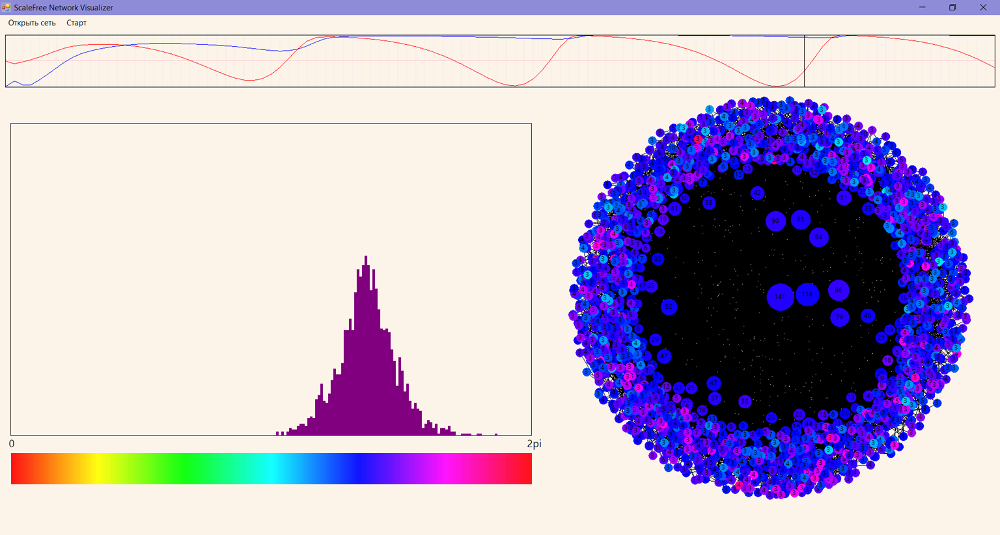

# Simulation of dynamics on scale-free network

### [PDF \[english\]](figures/abstract.pdf) | [PDF \[russian\]](figures/presentation.pdf) | [Video](https://www.youtube.com/watch?v=S5_qvD1hi0M) | [Video \[russian\]](https://www.youtube.com/watch?v=N9mCnfugrSI)

This is the code-base for the Bachelor's Thesis on topic: "Analysis of Dynamics on Scale-free Network". In this work the scale-free networks are analysed under the dynamics represented by Kuramoto oscilators. For more details please refer to PDF-overviews of the work.

## Implementation

C++ - for dynamics calculation
C# - for UI and visualization

Scale-free networks are generated using static modification of Bollobás–Riordan model together with LCD-diagram.

Runge Kutta 4th Order method is used for solving differential equations.